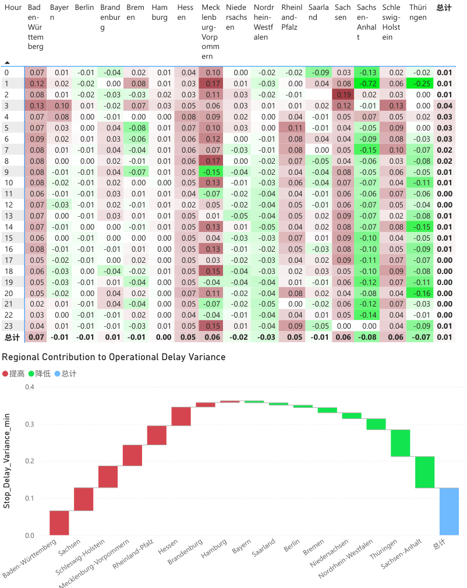
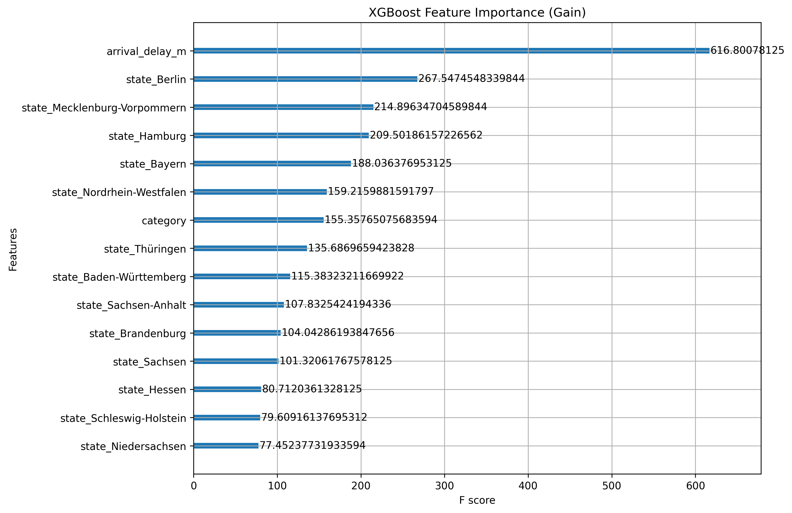
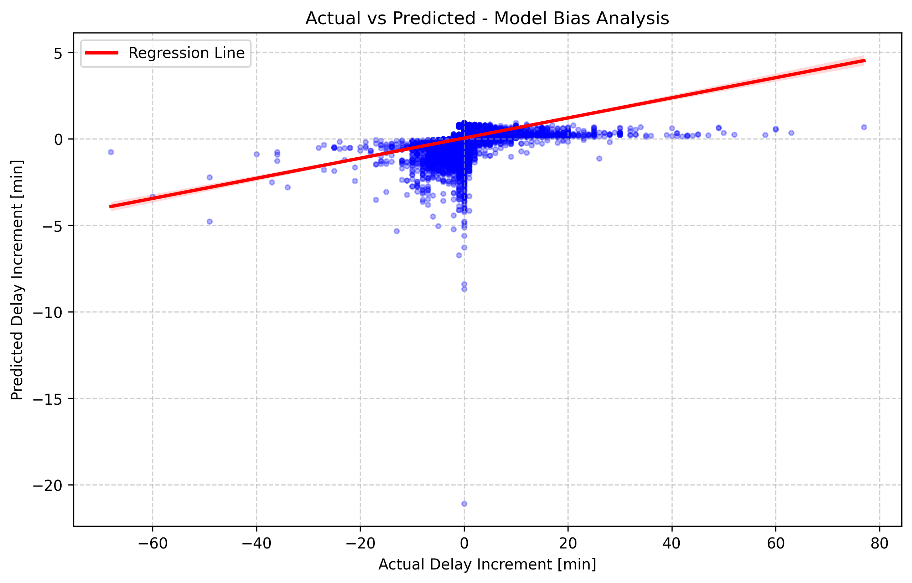
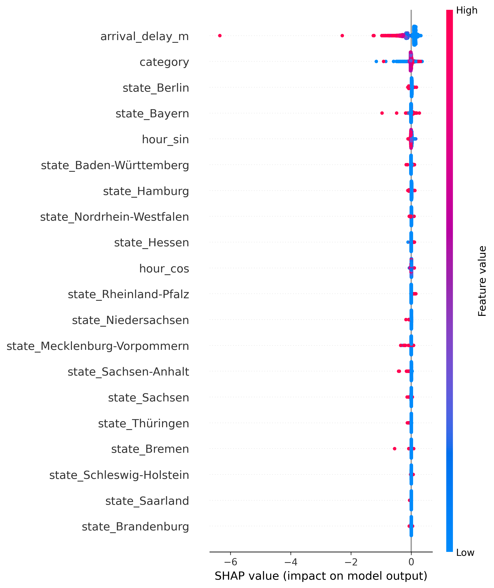

# 🚄 DB Network Analysis: Operational Resilience & Delay Prediction
### 德国铁路路网运营韧性分析与延误预测项目

## 📝 Projektübersicht / 项目概述
Dieses Projekt untersucht die betriebliche Effizienz des deutschen Schienennetzes. Ziel ist es, die strukturellen Ursachen für Verspätungszuwachse zu identifizieren und ein prädiktives Modell zu entwickeln, das die Netto-Verspätung (Departure - Arrival) an Bahnhöfen vorhersagt.

本项目深入探讨了德国铁路网的运营效率。目标是识别导致延误增加的结构性原因，并开发一个预测模型来推算车站的净延误增量（发车延误 - 到达延误）。

---

## 🛠 Tech Stack / 技术栈
* **Database:** PostgreSQL (Dockerized)
* **BI & Visualisierung:** Power BI
* **Data Science:** Python (Pandas, NumPy, Scikit-learn)
* **Machine Learning:** XGBoost
* **Model Explainability:** SHAP (Shapley Additive Explanations)

---

## 🔍 Phase 1: Deskriptive Analyse (Power BI) / 第一阶段：描述性分析
In der ersten Phase wurde eine explorative Datenanalyse (EDA) durchgeführt, um die Korrelation zwischen Infrastrukturdichte und Stabilität zu verstehen.
在第一阶段，通过探索性数据分析（EDA）研究了基础设施密度与稳定性之间的相关性。

### 核心发现 / Key Insights:
1.  **Regionale Unterschiede (区域差异):** Nordrhein-Westfalen (NRW) zeigt trotz hoher Stationsdichte eine höhere Resilienz als Baden-Württemberg (BW), was auf eine bessere strukturelle Redundanz hindeutet.
2.  **Morgendliche Instabilität (早间不稳定性):** Die Heatmap-Analyse verdeutlicht, dass die kritischen Verspätungszuwachse in den frühen Morgenstunden (0-8 Uhr) auftreten, während sich das System im Tagesverlauf stabilisiert.

> **Visualisierung:** 
>   
> *图表说明：右侧总计列显示，凌晨时段是站内流程效率最脆弱的窗口。*

---

## 🤖 Phase 2: Predictive Modeling (Python & XGBoost) / 第二阶段：预测建模
Um die Verspätungsdynamik zu quantifizieren, wurde ein XGBoost-Regressor implementiert.
为了量化延误动态，项目实现了一个 XGBoost 回归模型。

* **Target Variable:** `Departure_Delay - Arrival_Delay` (Netto-Verzögerung pro Halt).
* **Features:** Zeitliche Faktoren (Hour Sin/Cos), Regionale Merkmale (State), Bahnhofskategorie und Ankunftsverspätung.

### Modell-Performance / 模型表现:
* **MAE:** 0.3773 min (Hohe Genauigkeit bei Standardbetrieb / 常规运营下精度极高).
* **R² Score:** 0.0636 (Reflektiert die hohe stochastische Natur von Bahnbetriebsstörungen / 反映了铁路运营干扰的高度随机性).

---

## 📊 Phase 3: Modellevaluierung & Interpretierbarkeit / 第三阶段：模型评估与解释性

### 1. Feature Importance (Gain) / 特征重要性
Identifiziert die `Ankunftsverspätung` (Arrival Delay) als stärksten Prädiktor für weitere Verzögerungen.
识别出“到达延误”是进一步延误最强的预测因子。

### 2. Actual vs. Predicted Plot / 预测值对比真实值
Zeigt, dass das Modell bei alltäglichen Schwankungen stabil ist, jedoch extreme "Black Swan"-Ereignisse systemisch unterschätzt.
显示模型在日常波动下表现稳定，但对极端“黑天鹅”事件存在系统性低估。

### 3. SHAP Summary Plot / SHAP 解释分析
Visualisiert den Einfluss jedes Features auf die Vorhersage und belegt den Kaskadeneffekt von Verspätungen.
可视化每个特征对预测的影响，并证明了延误的级联效应。

---

## 📈 Fazit für Entscheider / 决策总结
Die Analyse zeigt, dass Verspätungen kein rein kapazitätsgetriebenes Problem sind, sondern stark von der **Prozessdisziplin in den frühen Morgenstunden** und der **Eingangsverspätung** abhängen. Strategische Puffer sollten dynamisch basierend auf der Netzknoten-Komplexität geplant werden.

分析表明，延误并非纯粹的容量问题，而是高度依赖于**早间的流程纪律**和**进站时的初始延误**。战略缓冲应基于路网节点的复杂程度进行动态规划。

---

### 📂 Repository Struktur / 仓库结构
* `db_network.pbix` Dateien und Dashboard Screenshots.
* `.py`  für Datenextraktion (PostgreSQL), Preprocessing und XGBoost-Training.
* `.png` Exportierte Evaluierungsdiagramme (SHAP, Importance, Residuals).

---
**Author:** Jinjing Cheng
**Role:** Data Analyst / Data Scientist